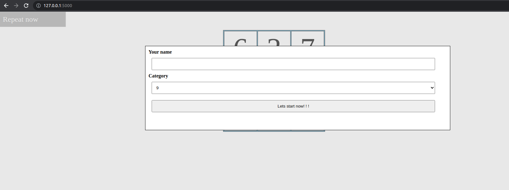
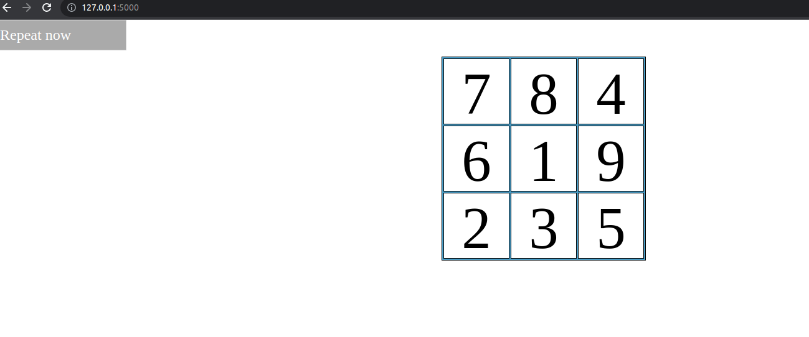
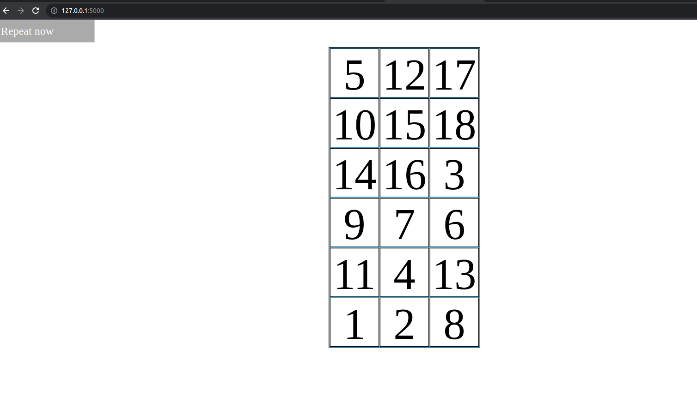

#Introduction

Game I develop using Flask for backend and FrontEnd I used comptsJS(personal framework I develop) [comptsjs]: https://www.npmjs.com/package/comptsjs

#Screenshot

#Technology

Flask for Backend
ComptsJS for Frontend
PostgreSQl for Database